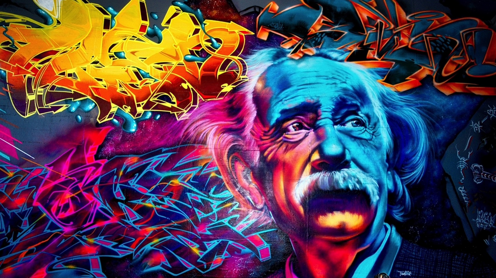

# Graffiti

**Graffiti** is writing or drawings made on a wall or other surface, usually without permission and within public view. _Graffiti ranges from simple written words to elaborate wall paintings, and has existed since ancient times, with examples dating back to ancient Egypt, ancient Greece, and the Roman Empire._

Graffiti is a controversial subject. In most countries, marking or painting property without permission is considered by property owners and civic authorities as defacement and vandalism, which is a punishable crime, citing the use of graffiti by street gangs to mark territory or to serve as an indicator of gang-related activities. Graffiti has become visualized as a growing urban "problem" for many cities in industrialized nations, spreading from the New York City subway system in the early 1970s to the rest of the United States and Europe and other world regions.

# Interesting Links
- [Beginnings](./pages/1_Beginnings.md)
- [Concepts](./pages/2_Concepts.md)
- [Later Developments](./pages/3_Later_Developments.md)
- [10 Facts that you might not know](./pages/10_Facts_Graffiti.md)

## Personal expression
Many graffitists choose to protect their identities and remain anonymous or to hinder prosecution.

With the commercialization of graffiti (and hip hop in general), in most cases, even with legally painted "graffiti" art, graffitists tend to choose anonymity. This may be attributed to various reasons or a combination of reasons. Graffiti still remains the one of four hip hop elements that is not considered "performance art" despite the image of the "singing and dancing star" that sells hip hop culture to the mainstream. Being a graphic form of art, it might also be said that many graffitists still fall in the category of the introverted archetypal artist.

Banksy is one of the world's most notorious and popular street artists who continues to remain faceless in today's society. He is known for his political, anti-war stencil art mainly in Bristol, England, but his work may be seen anywhere from Los Angeles to Palestine. In the UK, Banksy is the most recognizable icon for this cultural artistic movement and keeps his identity a secret to avoid arrest. Much of Banksy's artwork may be seen around the streets of London and surrounding suburbs, although he has painted pictures throughout the world, including the Middle East, where he has painted on Israel's controversial West Bank barrier with satirical images of life on the other side. One depicted a hole in the wall with an idyllic beach, while another shows a mountain landscape on the other side. A number of exhibitions also have taken place since 2000, and recent works of art have fetched vast sums of money. Banksy's art is a prime example of the classic controversy: vandalism vs. art. Art supporters endorse his work distributed in urban areas as pieces of art and some councils, such as Bristol and Islington, have officially protected them, while officials of other areas have deemed his work to be vandalism and have removed it.



### Documentaries
- 80 Blocks from Tiffany's (1979): A rare glimpse into late 1970s New York toward the end of the infamous South Bronx gangs, the documentary shows many sides of the mainly Puerto Rican community of the South Bronx, including reformed gang members, current gang members, the police, and the community leaders who try to reach out to them.
- Stations of the Elevated (1980), the earliest documentary about subway graffiti in New York City, with music by Charles Mingus
- Style Wars (1983), an early documentary on hip hop culture, made in New York City
- Piece by Piece (2005), a feature-length documentary on the history of San Francisco graffiti from the early 1980s
- Infamy (2005), a feature-length documentary about graffiti culture as told through the experiences of six well-known graffiti writers and a graffiti buffer
- NEXT: A Primer on Urban Painting (2005), a documentary about global graffiti culture
- RASH (2005), a feature documentary about Melbourne, Australia and the artists who make it a living host for street art
- Jisoe (2007): A glimpse into the life of a Melbourne, Australia, graffiti writer shows the audience an example of graffiti in struggling Melbourne Areas.
- Roadsworth: Crossing the Line (2009), about Montréal artist Peter Gibson and his controversial stencil art on public roads
- Exit Through The Gift Shop (2010) was produced by the notorious artist Banksy. It tells the story of Thierry Guetta, a French immigrant in Los Angeles, and his obsession with street art; Shepard Fairey and Invader, whom Guetta discovers is his cousin, are also in the film.
- Still on and non the wiser (2011) is a ninety-minute-long documentation that accompanies the exhibition with the same name in the Kunsthalle Barmen of the Von der Heydt-Museum in Wuppertal (Germany). It draws vivid portrayals of the artists by means of very personal interviews and also catches the creation process of the works before the exhibition was opened.
- Graffiti Wars (2011), a documentary detailing King Robbo's feud with Banksy as well as the authorities' differing attitude towards graffiti and street art

### DRAMAS

- {{item.year}}:{{item.drama}}:{{item.about}}


 [Beginnings](./pages/1_Beginnings.md#right) 
